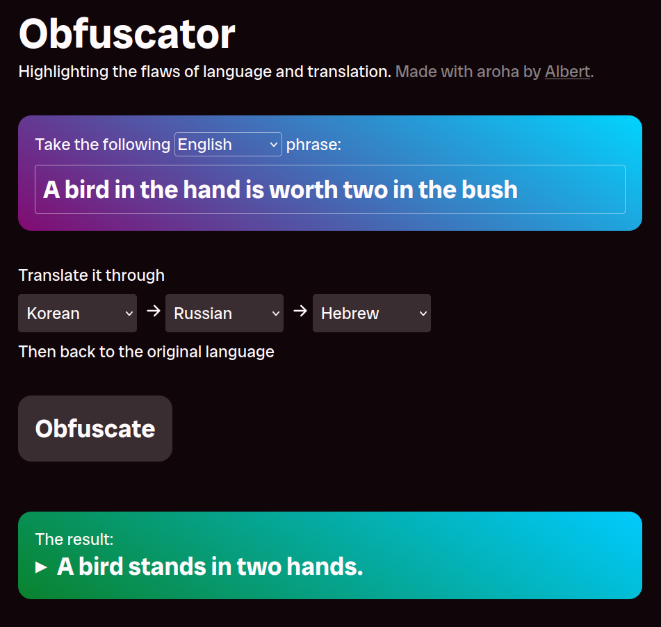

# Obfuscator

_Highlighting the potentially hilarious flaws of modern computer translators_



It follows the [original PHP version](https://github.com/albertnis/obfuscator) and the [SSR React rewrite which ran on Lambda](https://github.com/albertnis/obfuscator-serverless). The focus of this version is simplicity: few dependencies, little custom frontend JS and a straightforward hosting setup.

It is hosted at [obfuscator.albert.nz](https://obfuscator.albert.nz).

## Running locally

This CloudFlare Pages site is statically served from `src/web`. The backend code is defined in `src/web/_worker.js` as per Pages convention. All bundling and transpilation for the backend abstracted by the `wrangler` dependency (CloudFlare's CLI).

> [!IMPORTANT]
> Ensure `node` is available in PATH before running.
> `bun` is used as a very streamlined test runner and package manager only; `wrangler` relies on Node and will fail in subtle ways if it's not available.

Run local dev server on port 8787:

```shell
bun run dev
```

Run unit tests:

```shell
bun test
```
